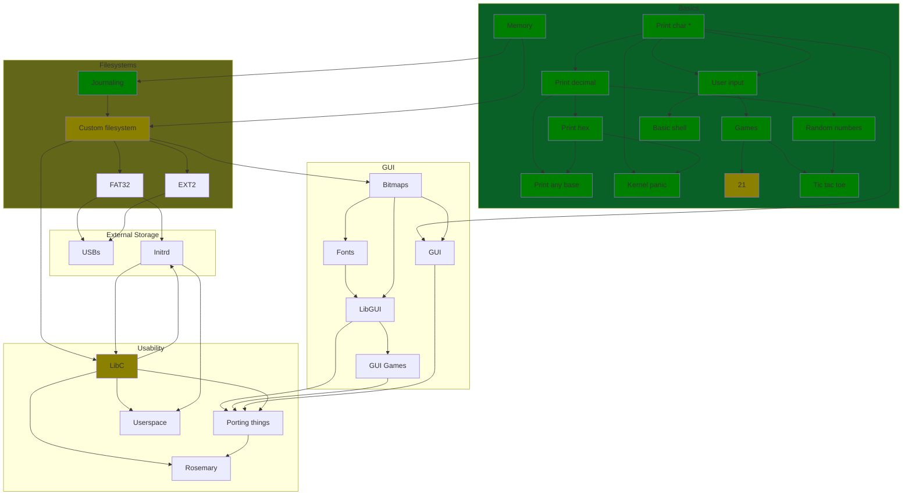

# NerdOS

### Good luck with install (you'll need it)

#### To install: 

`curl https://raw.githubusercontent.com/spartanproj/os/master/install.sh -o install.sh;chmod +x install.sh;./install.sh` - This requires sudo access (only tested on macOS and Debian)!

- If you want to install on a non-tested
or non Debian based system, install these packages: `build-essential bison flex libgmp3-dev libmpc-dev libmpfr-dev texinfo nasm qemu`. You may need more depending on how minimal your OS is

### Authored by [werdl](https://github.com/werdl)

  

### x86 OS that can do some things

- maybe ARM but not rn
- will just have to rewrite some asm

### FAQ

**Q**: Why AGPL? 
**A**: Source code should be available 
**Q**: Why x86? 
**A**: Because ARM asm is hard 
**Q**: Keyboard input isn't working!! oh no! 
**A**: it works on my machine...
   actually the reason is probably your keyboard.
try running with qemu-system-i386 
**Q**: the makefile isn't working!! help!!! 
**A**: do you have everything installed?
   If you do, try modifying the makefile a bit. 

### Things it can do

- print
- input
- kernel panic 😎
- kernel print
- IDT
- print integers of any base
- random numbers (done with Unix system time)
- memory allocation
- A few basic commands, but mainly shells will be in userspace
- Tic tac toe & coin flip
- 21 Game
- 'filesystem' WIP

### Plans

- libc
- text based GUI
- "port" a rewritten [`Rosemary`](http://github.com/werdl/rosemary)

### Compiling

#### You will need:

- A Unix-like environment (Windows no, BSD variants probably, MacOS YES!, Cygwin yes, Linux yes, other old Unix variants (eg Irix) probably?? maybe source install for packages)
- a gcc cross compiler (and binutils) for i386 or i686 ([here](https://wiki.osdev.org/GCC_Cross-Compiler)'s how to get that)
- qemu-system-i386 (`brew install -y qemu-system-i386` or the package manager on your distro (check the internet if it's not working.))
- patience

#### I can't compile the cross compiler...

- You'll probably be OK without for just running it, but to develop you'll need it
- You can techically run it with ordinary gcc, but not advised (it is a bit odd and you get a load of warnings)
- 
#### Steps:

- `git clone` this repo
- install to your dir of choice.
- run `make` to compile and run it. Then ctrl-c in your terminal to clean everything up.
- The script will work out what you have and haven't installed.
- 
#### It isn't working...

- If you are ssh, telnet, multipass etc then add the -curses flag to qemu in the Makefile.
- Establish if you are on an x86 computer (32-bit or 64-bit). If not, virtualise! It does not work on other architectures.
- You are on x86...
- If so, get out your nerd hat, read through the messages, and attempt to self-compile. If you cannot, then 

#### I don't have make!

- If you don't have make, get it. You will need a Unix env anyway so it will pay off
- If you are on Windows, I recommend you try WSL (Debian/similar) or Cygwin.

#### I love Windows/can't use anything else

- Step 1 - install msys2
- Step 2 - install qemu with the installer on their downloads page
- Step 3 - obtain a kernel.bin from releases or your friends
- Step 4 - run `path/to/qemu-system-i386 -rtc base=localtime -kernel path/to/kernel.bin` in msys2 

I still haven't found a way to compile on Windows, but I am working on it.

### Known limitations

- can't get *nix timestamp, computationally too much
- sleep function crashes if launched in the last 5ish seconds of a minute
- numbers under 10 are suffixed with a triangle ?

### How does random work?

##### In a nutshell:

At compile time, a bash script is run that grabs the Unix epoch time using `date +%s`. This is then written into a little header file along with some other RNG stuff. **DO NOT CHANGE THE NUMBERS** unless you know what you are doing!
<pre>
  _  _                       _     ___     ___                                                                                                      
 | \| |    ___      _ _   __| |   / _ \   / __|                                                                                                     
 | .` |   / -_)    | '_| / _` |  | (_) |  \__ \                                                                                                     
 |_|\_|   \___|   _|_|_  \__,_|   \___/   |___/                                                                                                     
_|"""""|_|"""""|_|"""""|_|"""""|_|"""""|_|"""""|                                                                                                    
"`-0-0-'"`-0-0-'"`-0-0-'"`-0-0-'"`-0-0-'"`-0-0-'                                                                                                    
   ___                              ___      __              ___     ___                                                                            
  /   \   _ _       o O O  __ __   ( _ )    / /      o O O  / _ \   / __|                                                                           
  | - |  | ' \     o       \ \ /   / _ \   / _ \    o      | (_) |  \__ \                                                                           
  |_|_|  |_||_|   TS__[O]  /_\_\   \___/   \___/   TS__[O]  \___/   |___/                                                                           
_|"""""|_|"""""| {======|_|"""""|_|"""""|_|"""""| {======|_|"""""|_|"""""|                                                                          
"`-0-0-'"`-0-0-'./o--000'"`-0-0-'"`-0-0-'"`-0-0-'./o--000'"`-0-0-'"`-0-0-'                                                                          
  _____   _                        _                          __                                                       _      _              __ _   
 |_   _| | |_     __ _    _ _     | |__    ___      o O O    / _|   ___      _ _     o O O    _ _    ___    __ _    __| |    (_)    _ _     / _` |  
   | |   | ' \   / _` |  | ' \    | / /   (_-<     o        |  _|  / _ \    | '_|   o        | '_|  / -_)  / _` |  / _` |    | |   | ' \    \__, |  
  _|_|_  |_||_|  \__,_|  |_||_|   |_\_\   /__/_   TS__[O]  _|_|_   \___/   _|_|_   TS__[O]  _|_|_   \___|  \__,_|  \__,_|   _|_|_  |_||_|   |___/   
_|"""""|_|"""""|_|"""""|_|"""""|_|"""""|_|"""""| {======|_|"""""|_|"""""|_|"""""| {======|_|"""""|_|"""""|_|"""""|_|"""""|_|"""""|_|"""""|_|"""""|  
"`-0-0-'"`-0-0-'"`-0-0-'"`-0-0-'"`-0-0-'"`-0-0-'./o--000'"`-0-0-'"`-0-0-'"`-0-0-'./o--000'"`-0-0-'"`-0-0-'"`-0-0-'"`-0-0-'"`-0-0-'"`-0-0-'"`-0-0-'  
  _  _                              __ _                      _                      _                _       _                _      _        _    
 | \| |    ___   __ __ __   o O O  / _` |   ___      o O O   (_)    _ _      ___    | |_    __ _     | |     | |      o O O   (_)    | |_     | |   
 | .` |   / _ \  \ V  V /  o       \__, |  / _ \    o        | |   | ' \    (_-<    |  _|  / _` |    | |     | |     o        | |    |  _|    |_|   
 |_|\_|   \___/   \_/\_/  TS__[O]  |___/   \___/   TS__[O]  _|_|_  |_||_|   /__/_   _\__|  \__,_|   _|_|_   _|_|_   TS__[O]  _|_|_   _\__|   _(_)_  
_|"""""|_|"""""|_|"""""| {======|_|"""""|_|"""""| {======|_|"""""|_|"""""|_|"""""|_|"""""|_|"""""|_|"""""|_|"""""| {======|_|"""""|_|"""""|_| """ | 
"`-0-0-'"`-0-0-'"`-0-0-'./o--000'"`-0-0-'"`-0-0-'./o--000'"`-0-0-'"`-0-0-'"`-0-0-'"`-0-0-'"`-0-0-'"`-0-0-'"`-0-0-'./o--000'"`-0-0-'"`-0-0-'"`-0-0-' 
   ___                                              _ __     _       _                        _      _        _                                     
  / __|    ___      o O O   __      ___    _ __    | '_ \   (_)     | |     ___      o O O   (_)    | |_     | |                                    
 | (_ |   / _ \    o       / _|    / _ \  | '  \   | .__/   | |     | |    / -_)    o        | |    |  _|    |_|                                    
  \___|   \___/   TS__[O]  \__|_   \___/  |_|_|_|  |_|__   _|_|_   _|_|_   \___|   TS__[O]  _|_|_   _\__|   _(_)_                                   
_|"""""|_|"""""| {======|_|"""""|_|"""""|_|"""""|_|"""""|_|"""""|_|"""""|_|"""""| {======|_|"""""|_|"""""|_| """ |                                  
"`-0-0-'"`-0-0-'./o--000'"`-0-0-'"`-0-0-'"`-0-0-'"`-0-0-'"`-0-0-'"`-0-0-'"`-0-0-'./o--000'"`-0-0-'"`-0-0-'"`-0-0-'  
</pre>
