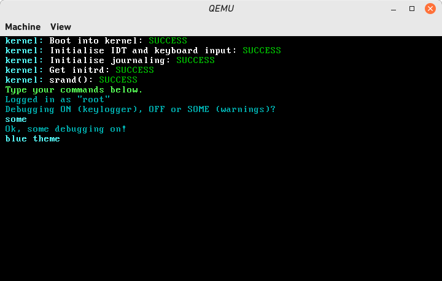
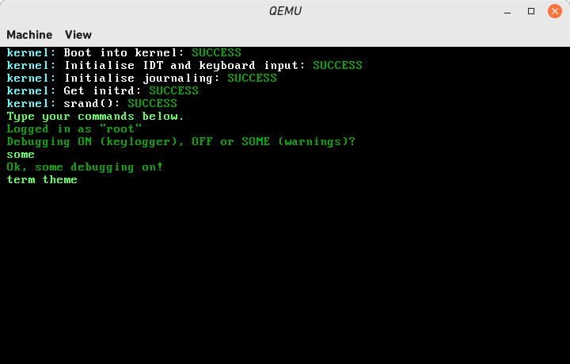
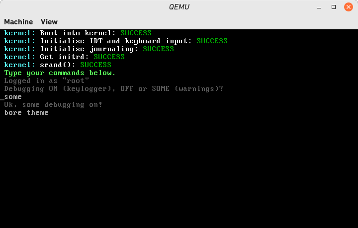
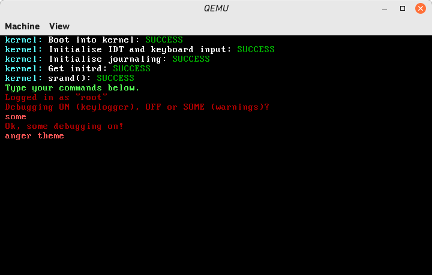
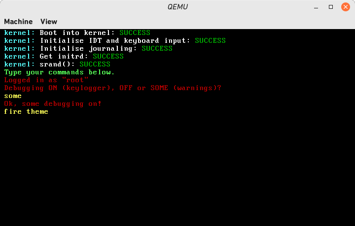
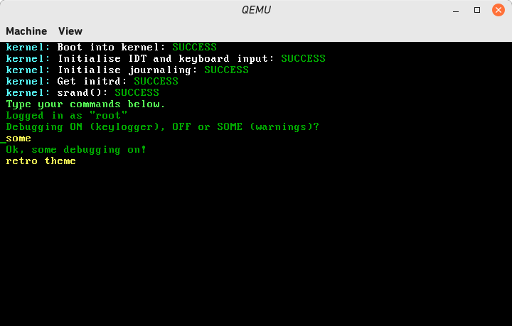

the theme names are in capitals for the color.conf file.

# dark:

  ## BLUE:

        is default
        computer: Dark Cyan
        user: Cyan

  ### TERM:

        computer: Dark Green
        user: Green

  ### PINK:

        computer: Magenta
        user: Lilac

  ### BORE:

        computer: DarkGrey
        user: Light Grey

   ### ANGER:

        computer: Deep Red
        user: LIGHT RED

   ### FIRE:

        computer: Deep Red
        user: Yellow

   ### RETRO:

        computer: Dark Green
        user: Yellow

# light:

    coming soon...
